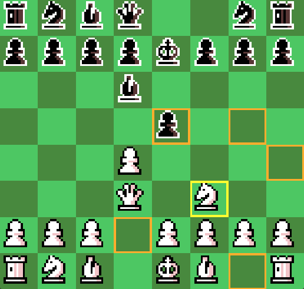

# Chess game

## Credits

#### Developed by: [Rafael Marinho dos Anjos](https://github.com/Rafael-Marinho-dos-Anjos)

#### Sprites: [link](https://spicygame.itch.io/chess-pieces#google_vignette)



## How to run game first time:

1. Clone repository (or download and unzip files): ```git clone https://github.com/Rafael-Marinho-dos-Anjos/chess.git```

2. Assert your computer have Pyton 3.9+ installed

3. Install dependencies: ```pip install -r requirements.txt```

4. Run main file: ```python main.py```

To run game again just repeat step 4.

## How to play:

- All input commands are made through the mouse;

- Left click over a square will select it;

- Right click anywhere will undo the current selection;

- Selected squares are shown in yellow;

- Whether there is a piece of the current turn's player on the selected square, the possible movement squares will be shown in orange color;

- To move a selected piece to another square, just left click over desired square;

- If the current turn's player is under xeque, his king will be shown in red;

- If a movement puts or keeps the current turn's player under xeque, this play cannot be made;

- All piece movements are in accordance with the rules of chess.

## Have fun!